# Business Integration Plan

Last updated: June 13, 2026.

## Purpose

This plan explains how CrisisCoord would integrate into existing businesses after the hackathon demo.

The short answer:

> CrisisCoord should integrate through a safe crisis-signal layer first, not by directly connecting agents to production systems. Existing tools send sanitized incident signals into CrisisCoord; CrisisCoord opens a Band room, coordinates the five agents, stores an audit trail, and returns draft decisions or recommended actions for human approval.

The MVP remains synthetic. Real business integrations are a staged roadmap.

## Why This Matters

The demo scenario is:

```text
At 2:47 AM, unauthorized access was detected in the payment system.
50,000 card records were potentially exposed.
```

In a real company, that signal would not come from someone typing a sentence into a demo form. It might come from:

- SIEM alert correlation
- EDR/XDR detection
- cloud audit logs
- payment processor alert
- DLP alert
- support escalation
- vendor breach notice
- security analyst declaration
- executive incident declaration

CrisisCoord needs a clean way to accept those signals without over-collecting sensitive data or giving AI unsafe access to production systems.

## Integration Principle

Integrate in this order:

1. Human-entered synthetic or manual signals.
2. Read-only inbound webhooks.
3. Read-only enterprise connectors.
4. Ticketing and collaboration updates.
5. Human-approved outbound actions.

Do not begin with agents that can directly change production infrastructure, send external communications, or file regulatory notices.

## Enterprise Integration Architecture

```mermaid
flowchart LR
  Sources["Existing business systems"]
  Gateway["Integration gateway"]
  Filter["Sensitivity classifier + redaction"]
  Signal["Normalized crisis signal"]
  API["CrisisCoord API"]
  DB["Supabase app state + audit"]
  Band["Band crisis room"]
  Agents["Five agents"]
  Human["Human reviewers"]
  Drafts["Draft outputs + decision requests"]
  Outbound["Approved outbound connectors"]

  Sources --> Gateway
  Gateway --> Filter
  Filter --> Signal
  Signal --> API
  API --> DB
  API --> Band
  Band <--> Agents
  Agents --> DB
  DB --> Drafts
  Drafts --> Human
  Human --> Outbound
```



## Integration Layers

### Layer 1: Crisis Signal Intake

Purpose:

- Convert existing business alerts into a normalized `CrisisSignal`.

Sources:

- manual incident declaration
- demo scenario launcher
- webhook from security tooling
- ticketing-system event
- customer support escalation
- vendor notice

Data rule:

- Only send the minimum facts needed to start coordination.
- Do not send raw card numbers, patient data, customer lists, secrets, credentials, or full logs to the model.

Example normalized signal:

```json
{
  "sourceType": "payment_processor_alert",
  "detectedAt": "2026-06-13T02:47:00Z",
  "summary": "Unauthorized access detected in payment system. 50,000 card records potentially exposed.",
  "affectedSystems": ["payment-system"],
  "affectedDataCategories": ["payment-card-data", "personal-data-candidate"],
  "initialSeverity": "critical",
  "knownFacts": [
    "Unauthorized access was detected.",
    "Payment system is involved.",
    "50,000 card records may be affected."
  ],
  "unknowns": [
    "Whether records were exfiltrated.",
    "Which jurisdictions are affected.",
    "Whether containment is complete."
  ]
}
```

### Layer 2: Integration Gateway

Purpose:

- Keep third-party systems away from the core agent runtime.

Responsibilities:

- verify webhook signatures
- rate-limit incoming events
- deduplicate events with idempotency keys
- map vendor fields into CrisisCoord fields
- reject unsafe payloads
- record source system and event ID
- route only sanitized facts to agents

Recommended endpoint later:

```text
POST /api/integrations/signals
```

MVP equivalent:

```text
POST /api/incidents
```

### Layer 3: Sensitivity And Redaction

Purpose:

- Prevent sensitive business data from entering AI prompts or public demo screens.

Pipeline:

1. Detect data categories: payment, personal, health, employee, credentials, legal, financial, confidential business data.
2. Reject payloads with raw secrets or raw payment card data.
3. Redact personal identifiers and confidential fields.
4. Store redaction status.
5. Send only a sanitized fact packet to model providers.

Prompt rule:

> Model providers receive sanitized incident facts, not raw evidence dumps.

### Layer 4: Band Crisis Room

Purpose:

- Create the shared coordination room.

Real business behavior:

- Assessment creates or seeds the Band room.
- Legal, Technical, Communications, and Escalation agents are added.
- Human roles can be invited or represented as approval owners.
- Important handoffs happen as Band messages/events.
- Supabase stores the queryable app state and audit references.

This is where the product remains different from a normal alert dashboard.

### Layer 5: Business System Context

Purpose:

- Pull safe context from existing systems only when needed.

Allowed early:

- ticket title and incident ID
- alert metadata
- affected system names
- severity
- event timestamps
- owner/team mappings
- sanitized counts
- vendor notice summary

Avoid early:

- raw customer records
- full system logs
- screenshots with customer data
- privileged legal advice
- unredacted emails
- secrets or tokens

### Layer 6: Human-Approved Outbound Actions

Purpose:

- Let businesses push approved outcomes back to their tools.

Examples:

- create/update ServiceNow or Jira incident
- post an internal Slack/Teams update
- attach approved draft to a ticket
- notify incident commander that approval is required
- create a task for Legal, Technical, or Communications owner

Not allowed without explicit human approval:

- customer notification
- regulator notice
- public status page update
- media statement
- production containment command
- account lockout at scale
- evidence deletion or mutation

## Existing Business Systems To Support

| Business area | Example systems | CrisisCoord integration role |
| --- | --- | --- |
| Security operations | SIEM, EDR/XDR, cloud security, DLP | Send read-only crisis signals and sanitized technical context. |
| Identity and access | SSO, IAM, Okta-style audit events | Provide affected identity context and owner mapping. |
| Ticketing and ITSM | ServiceNow, Jira, Linear-style tools | Create/update incident records and tasks after human approval. |
| Communications | Slack, Teams, email | Internal notifications and review requests, not external sends in MVP. |
| Legal/privacy/GRC | policy registers, privacy tools, risk systems | Store review status, source references, and legal/privacy owner decisions. |
| Customer support | CRM/support ticket tools | Surface escalation patterns or customer-impact indicators after redaction. |
| Payment operations | payment processor alerts, PCI workflows | Signal payment-card exposure candidates and route to Legal/Compliance. |
| Evidence storage | object storage, document management | Store synthetic or redacted evidence references, not raw sensitive dumps. |

## Adoption Path For A Real Business

### Phase 0: Hackathon Demo

- Synthetic scenario only.
- Manual/demo signal launcher.
- Seeded incident state.
- Visible Band handoffs.
- Provider metadata.
- No real business data.

### Phase 1: Internal Sandbox

- Use fake company data.
- Test real auth, roles, and deployment.
- Validate Supabase schema and RLS.
- Test Band room creation.
- Test AI/ML API and Featherless latency.
- Run tabletop exercises with security/legal/comms teammates.

### Phase 2: Read-Only Pilot

- Accept inbound webhook signals from one safe source.
- Store only alert metadata and sanitized summaries.
- No outbound actions except internal review tasks.
- No raw customer data in AI prompts.
- Human reviewers approve every conclusion.

### Phase 3: Controlled Enterprise Pilot

- Add SSO and role mapping.
- Add ticketing integration.
- Add internal collaboration notifications.
- Add redaction and privacy-review workflow.
- Add audit export.
- Add integration health dashboards.

### Phase 4: Approved Outbound Workflows

- Push approved decisions back to business systems.
- Attach approved drafts to tickets.
- Create tasks for owners.
- Add policy-controlled external communication workflows only after legal/security review.

## How The 2:47 AM Scenario Works In A Business

1. Payment processor or SIEM detects suspicious access at `2:47 AM`.
2. Integration gateway receives a signed webhook.
3. Gateway normalizes the alert into a crisis signal.
4. Sensitivity filter blocks raw card data and keeps only sanitized counts/categories.
5. CrisisCoord creates an incident and Band crisis room.
6. Assessment Agent classifies the event as a critical payment-data exposure candidate.
7. Legal Agent creates obligation candidates and review clocks.
8. Technical Agent summarizes affected systems, containment status, and evidence confidence through Featherless.
9. Communications Agent stays blocked until Legal and Technical outputs are validated.
10. Communications drafts regulator, customer, executive, and internal updates in review-only state.
11. Escalation Agent asks: "Do we proactively notify customers before every detail is confirmed?"
12. Human reviewers approve, reject, or request changes.
13. Approved internal tasks or ticket updates can sync back to business tools.

## Required Data Contracts

### Inbound Signal Contract

Minimum fields:

- source system
- source event ID
- detected time
- received time
- summary
- affected system candidates
- data category candidates
- known facts
- unknowns
- severity candidate
- evidence references
- redaction status

### Outbound Decision Contract

Minimum fields:

- incident ID
- decision request ID
- decision type
- approver role
- status
- approved/rejected/requested changes
- reason
- timestamp
- linked drafts or findings
- audit event ID

## Integration Security Rules

- Use least-privilege service accounts.
- Prefer read-only connectors first.
- Verify webhook signatures.
- Use idempotency keys for inbound signals.
- Rate-limit integration endpoints.
- Store source event IDs for traceability.
- Separate tenant data.
- Keep service-role keys server-side.
- Do not expose raw provider errors to users.
- Do not send secrets or raw regulated data to model providers.
- Require human approval before external or destructive actions.

## Demo Positioning

When explaining this to judges:

> The hackathon demo starts with a synthetic 2:47 AM payment-system signal. In a real business, that same signal would arrive from a SIEM, EDR, payment processor, or ticketing webhook. CrisisCoord does not give agents direct production control. It normalizes the signal, redacts sensitive data, opens a Band crisis room, coordinates five agents, and routes external or high-risk decisions to humans.

## What We Should Not Build Yet

- full connector marketplace
- raw log ingestion pipeline
- customer-data import
- automatic regulator filing
- automatic customer notification
- production containment commands
- broad SOC dashboard
- external email/status-page publishing

## Source Anchors

- [NIST SP 800-61 Rev. 3](https://nvlpubs.nist.gov/nistpubs/SpecialPublications/NIST.SP.800-61r3.pdf): incident response should integrate governance, detection, response, recovery, communications, and roles.
- [NIST AI RMF Core](https://airc.nist.gov/airmf-resources/airmf/5-sec-core/): human-AI oversight, governance, mapping, measuring, and managing risk.
- [OWASP Top 10 for LLM Applications](https://owasp.org/www-project-top-10-for-large-language-model-applications/): prompt injection, excessive agency, sensitive information disclosure, and unbounded consumption are key design risks.
- [OECD Privacy Principles](https://www.oecd.org/en/topics/privacy-principles.html): global privacy principles, cross-border data protection, and accountability.
- [ISO/IEC 27035-1:2023](https://www.iso.org/standard/78973.html): globally applicable information security incident management principles and process.
- [Band of Agents Hackathon](https://lablab.ai/ai-hackathons/band-of-agents-hackathon): Band should be the active coordination layer for multi-agent handoffs.
