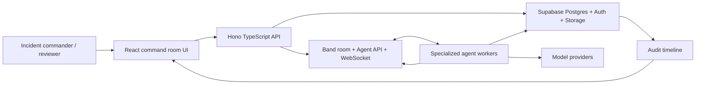

# CrisisCoord System Architecture

Last updated: June 13, 2026.

## Architecture Goal

Build a visible, auditable, multi-agent crisis workflow where the frontend, backend, database, Band room, model providers, and human-review gates all reinforce the same product story.

For how this architecture connects to existing business systems after the demo, see [business-integration-plan.md](./business-integration-plan.md). For the final agent communication model, global sandboxes, contributor roles, and implementation sequence, see [../product/master-implementation-guide.md](../product/master-implementation-guide.md).

## System Map



## Frontend Section

The frontend is the product surface. It should make the crisis workflow understandable in seconds.

Recommended stack:

- React
- TypeScript
- Vite
- Tailwind CSS
- TanStack Router
- TanStack Query
- TanStack Table
- React Hook Form
- Zod
- lucide-react
- Playwright

Primary screen:

- Crisis Command Room

Required regions:

- incident summary bar
- severity, phase, deadline, and refresh state
- agent rail
- Band room timeline
- handoff/dependency map
- legal obligations panel
- technical findings panel
- communications draft review
- escalation decision desk
- audit timeline

UI rules:

- Show the real workflow first, not a landing page.
- Use dense, calm, enterprise UI.
- Support mobile, tablet, laptop, desktop, and wide desktop layouts.
- Use semantic state colors for severity, blocked, review, complete, and failed.
- Pair color with text/icons.
- Keep generated content in review state.
- Show why an agent is blocked.
- Show source facts, assumptions, missing facts, and confidence.
- Keep tables and timelines stable during updates.
- Follow [../platform-support.md](../platform-support.md) for viewport targets, cross-platform setup expectations, and responsive acceptance criteria.

Frontend data responsibilities:

- render incident state from API/Supabase
- render Band room message/event references
- show agent statuses and dependency gates
- submit human approval/rejection decisions
- never enforce critical workflow rules only in the browser

## UI/UX And Figma Section

Figma should lead the visual system before code polish begins.

Do not one-shot the UI. Page planning, priorities, Figma frames, and the first low-fidelity wireframe are documented in [../design/ui-page-plan.md](../design/ui-page-plan.md).

Figma deliverables:

- design tokens
- command-room desktop frame
- mobile reviewer frame
- agent rail components
- timeline components
- decision card components
- draft review components
- table and evidence row components
- blocked/running/failed/needs-review states
- prototype of the 60-90 second demo path

Figma design principles:

- command center, not marketing page
- operational SaaS, not decorative AI demo
- small radii, crisp borders, compact typography
- semantic color system
- no copied third-party templates
- no hidden workflow explanation that only exists in narration

Figma-to-code mapping:

- Figma tokens map to Tailwind theme values.
- Figma components map to React components.
- Figma variants map to explicit status props.
- Figma prototype steps map to Playwright demo checks.

## Backend Section

The backend is the rule layer. It should keep the workflow safe even if the UI is bypassed.

Recommended stack:

- TypeScript
- Hono API
- Zod validation
- Supabase client
- Band API adapter
- model-provider adapter
- Vitest

Core backend responsibilities:

- incident intake
- business integration gateway for future read-only crisis signals
- synthetic scenario seeding
- crisis room creation
- agent run orchestration
- Band room references
- Communications dependency gate
- draft generation request handling
- decision request creation
- audit event recording
- error and retry handling

Important backend rules:

- Communications cannot run until Legal and Technical findings exist.
- Generated communications remain drafts until approved.
- Agent outputs are untrusted until parsed and validated.
- Every state-changing request records an audit event.
- All retryable operations use idempotency keys.
- Service-role keys never reach the browser.

Suggested API routes:

```text
POST /api/incidents
POST /api/integrations/signals
GET  /api/incidents/:incidentId
POST /api/incidents/:incidentId/start-room
POST /api/incidents/:incidentId/agents/:agentName/run
GET  /api/incidents/:incidentId/timeline
POST /api/incidents/:incidentId/drafts
POST /api/decisions/:decisionId/approve
POST /api/decisions/:decisionId/reject
GET  /api/health
```

## Agent Architecture

The five agents should be distinct in Band and in our data model.

The detailed operating model for how these agents communicate through Band messages, Band events, and Supabase records is defined in [../product/master-implementation-guide.md](../product/master-implementation-guide.md).

Agents:

- Crisis Assessment Agent
- Legal & Regulatory Agent
- Technical Forensics Agent
- Stakeholder Communications Agent
- Escalation & Decision Agent

Agent execution options:

- TypeScript workers if the Band TypeScript SDK/adapters are stable enough for our use.
- Python Band SDK workers if the Python path is faster and better documented during the hackathon.
- Direct Agent API integration only if SDK path blocks us.

Recommended first implementation:

1. Build synthetic state in UI and Supabase.
2. Implement Zod contracts for each agent.
3. Connect Band room creation and agent identity validation.
4. Connect one agent end to end.
5. Add remaining agents and dependency gates.

## Band-Associated Tools To Consider

Band should remain the collaboration backbone. The useful surrounding tools are the pieces that make Band easier to use, observe, or extend.

Band platform capabilities:

- Agent API for identity, peers, rooms, participants, messages, processing state, events, context, contacts, and memories.
- WebSocket subscriptions for live message delivery.
- Human API for human-owned agent management if needed later.
- Band SDK for WebSocket handling, room lifecycle, message routing, crash recovery, and tool exposure.
- Platform tools such as `thenvoi_send_message`, `thenvoi_send_event`, `thenvoi_add_participant`, `thenvoi_get_participants`, `thenvoi_lookup_peers`, and `thenvoi_create_chatroom`.
- Framework adapters for LangGraph, CrewAI, Pydantic AI, Claude SDK, Codex, OpenAI-compatible clients, Gemini, Google ADK, Letta, and Parlant.
- A2A and ACP protocol adapters for remote agent interoperability.
- Band MCP/docs support for developer tooling, with the caveat that REST-only MCP is not enough for live agent message receiving.
- Codeband as a reference for multi-agent planning, review, branch isolation, and risk-aware merge workflows. It is not part of the product runtime.

Recommended use:

- Use Band SDK or Agent API for runtime collaboration.
- Use Band platform tools for messages, events, peer lookup, participant management, and chat room creation.
- Use Codeband ideas only for our development process, not as product code.
- Use AgentOps-style observability only if setup is fast and does not distract from the demo.
- See [../research/technology-partners.md](../research/technology-partners.md) for the partner/provider plan.
- See [partner-implementation-requirements.md](./partner-implementation-requirements.md) for required partner proof before submission.

## Model Provider Decision

We do not strictly need OpenAI as a model provider.

The project needs an OpenAI-compatible client shape because AI/ML API and Featherless expose compatible chat-completion patterns. That does not mean the app must use OpenAI keys or OpenAI-hosted models.

Recommended model strategy:

- Required main-path provider: AI/ML API
- Required visible open-model provider: Featherless AI
- Optional direct OpenAI: only if we deliberately choose it later for reliability
- Optional AgentOps: observability only, after the core demo works

Implementation rule:

- Call the abstraction `model-provider`, not `openai`.
- Name environment variables after the provider.
- If we use the `openai` npm package as a client, document it as a transport/client library, not the required provider.
- Keep AI/ML API and Featherless provider-specific code inside the provider layer.
- Store provider, model, latency, retry count, and failure reason on agent runs.
- Surface provider fallback in the UI/audit log so the demo remains explainable.
- The demo is incomplete unless at least one visible run uses Featherless and multiple main-path runs use AI/ML API.

## Data Architecture

Supabase should store application truth.

Suggested tables:

- `incidents`
- `crisis_rooms`
- `agent_runs`
- `agent_findings`
- `regulatory_obligations`
- `technical_findings`
- `communication_drafts`
- `decision_requests`
- `decision_responses`
- `audit_events`
- `evidence_artifacts`

Source-of-truth rules:

- Band is the collaboration record.
- Supabase is the app state and queryable audit record.
- Model providers are not a source of truth.
- The UI is not a source of truth.

## Compliance Architecture

Compliance should be treated as a review workflow, not an automatic legal engine.

Each obligation candidate should include:

- rule family
- jurisdiction or sector
- crisis signal facts
- deadline estimate
- confidence
- missing facts
- owner role
- source reference
- review status

The Legal Agent can recommend possible obligations. A human Legal Reviewer approves, rejects, or marks them unknown.

## Security And Safety Architecture

Minimum safety controls:

- synthetic data only
- no secrets in Git
- RLS on Supabase tables
- role-based approval permissions
- model output validation
- prompt/response logging only when needed
- redaction-ready output shapes
- no automatic external sending
- no direct model access from browser
- read-only enterprise integrations first
- webhook signature verification and idempotency for future integration endpoints
- sensitivity classification/redaction before any future model-backed real-data workflow

## Build Order

1. Figma command-room wireframe.
2. Command-room static UI with synthetic data.
3. Communications review static UI.
4. Decision queue static UI.
5. Supabase schema and seed data.
6. Hono API routes and Zod contracts.
7. Band room creation and agent key validation.
8. One agent end to end through Band.
9. Remaining agents and dependency gates.
10. Audit timeline and Playwright demo checks across mobile, tablet, laptop, and desktop.

## Sources

- Band SDK overview: https://docs.thenvoi.com/integrations/sdks/overview
- Band framework adapters: https://docs.thenvoi.com/integrations/adapters
- Band API introduction: https://docs.thenvoi.com/api/introduction
- Band Agent API: https://docs.thenvoi.com/api/agent-api
- Band remote agent guide: https://docs.thenvoi.com/getting-started/connect-remote-agent
- Codeband repository: https://github.com/thenvoi/codeband
- Hackathon page: https://lablab.ai/ai-hackathons/band-of-agents-hackathon
