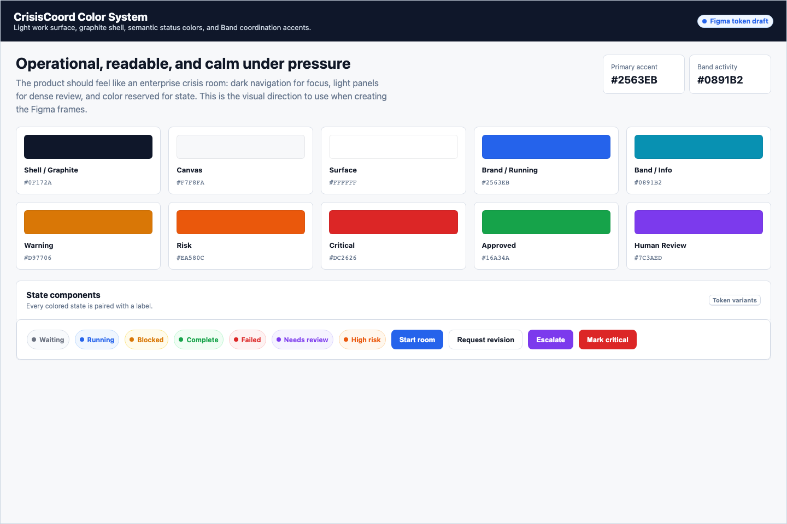
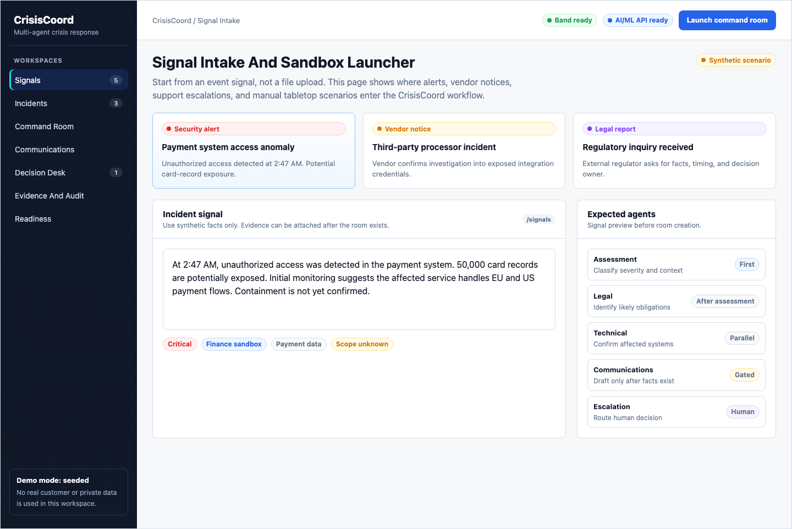
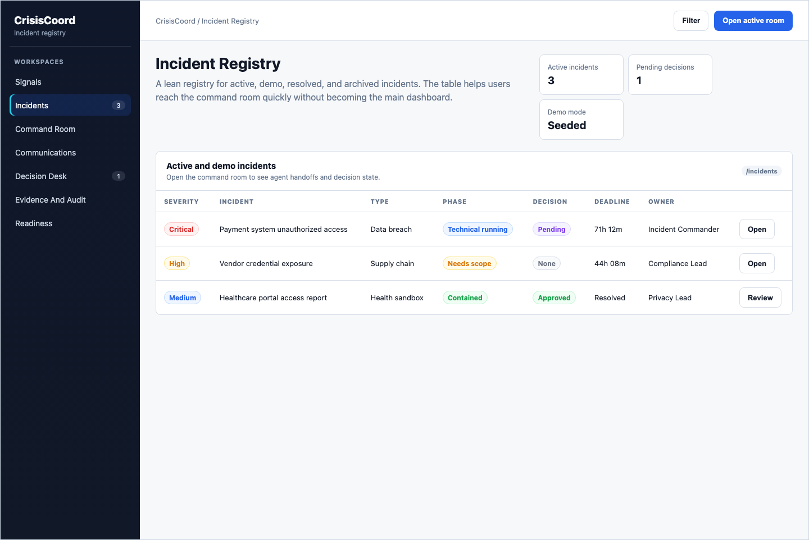
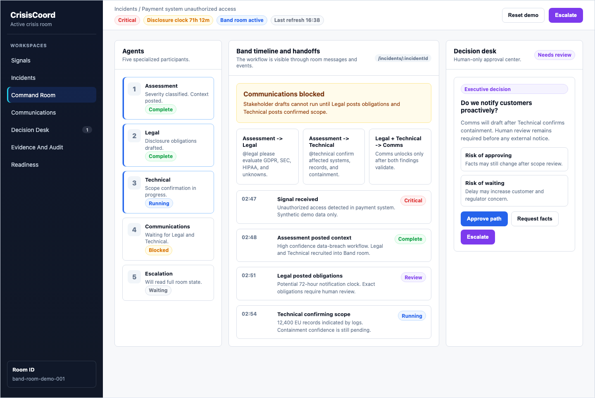
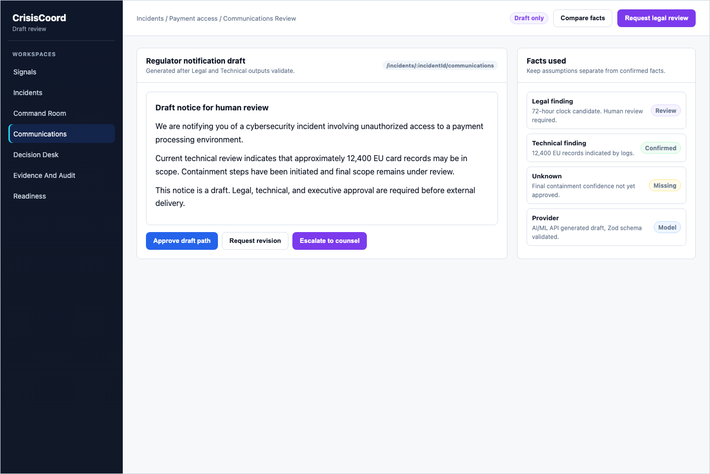
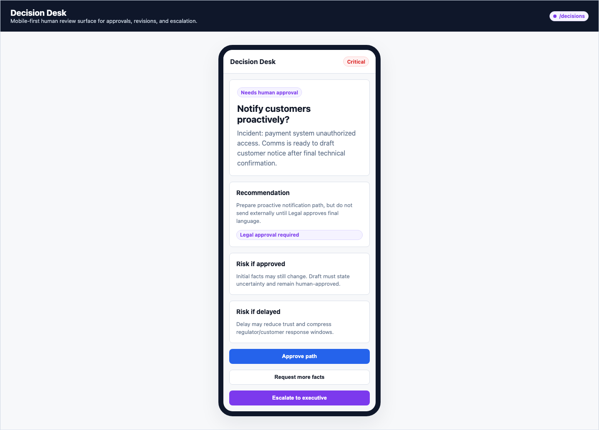
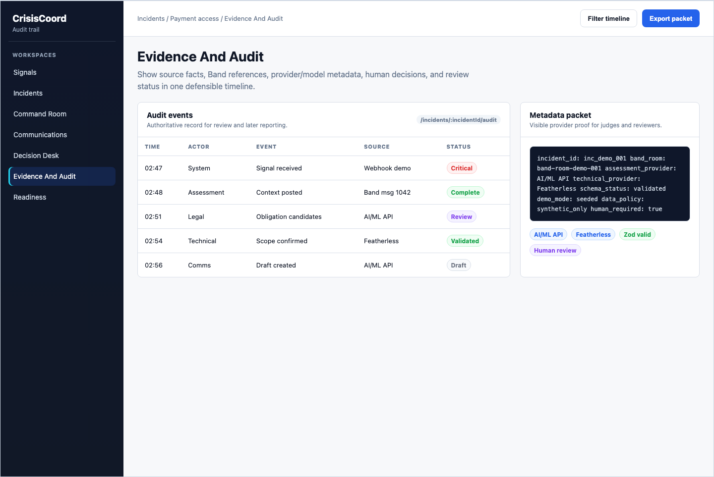
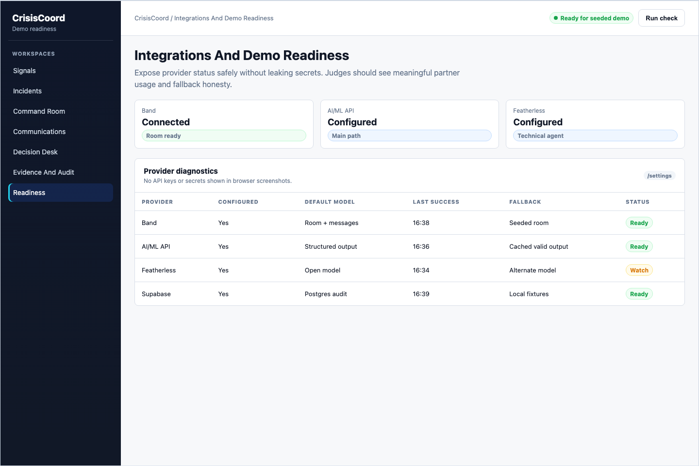

# UI Design Mockups

Last updated: June 13, 2026.

These static mockups turn the CrisisCoord color system and seven-workspace UI plan into visual references for Figma.

They are not production app code. Use them to guide layout, color, density, and interaction states before building React screens.

For the newer live-data patterns inspired by external cybersecurity references, use [live-data-ui-components.md](./live-data-ui-components.md). Those additions stay inside the existing seven workspaces.

## Source

- [mockups/index.html](./mockups/index.html)
- [mockups/styles.css](./mockups/styles.css)
- [mockups/README.md](./mockups/README.md)

## Editable Figma File

- [CrisisCoord UI Sketches - Responsive Workspaces](https://www.figma.com/design/TvJbJSgxMEnanM4DuCRi0L)

Current Figma status:

- Created in Dr_Mkelvo's team.
- Contains the color/token board, paint and text styles, and local editable component references.
- Uses three physical Figma pages because the selected Starter team is limited to three pages. The requested six logical sections are represented inside those pages.
- The 21 baseline workspace frames and the four required screenshot captures are still queued because the Figma MCP tool quota was exhausted during generation.
- The current canvas is not the final sketch set. Repair it using [figma-repair-spec.md](./figma-repair-spec.md), which requires seven workspace triptychs with desktop, tablet, and mobile frames.

## Screenshots

Screenshots are exported into [mockups/screenshots](./mockups/screenshots).

Current references:

### Color System



### Signal Intake And Sandbox Launcher



### Incident Registry



### Crisis Command Room



### Communications Review



### Decision Desk



### Evidence And Audit



### Integrations And Demo Readiness



## Export Command

Run this after editing [mockups/index.html](./mockups/index.html) or [mockups/styles.css](./mockups/styles.css):

```bash
NODE_PATH=/Users/mac/.cache/codex-runtimes/codex-primary-runtime/dependencies/node/node_modules \
  /Users/mac/.cache/codex-runtimes/codex-primary-runtime/dependencies/node/bin/node \
  scripts/export-ui-mockups.cjs
```

## Design Notes

The visual system uses:

- graphite/deep navy app shell
- light readable work panels
- blue/cyan for active Band coordination
- amber/orange for waiting, risk, and missing facts
- red for critical or failed states
- green for approved or complete states
- purple for human review and escalation

Every state should pair color with text. Do not rely on color alone.

## Figma Starting Point

Start by recreating these frames:

1. Color system board.
2. Signal Intake And Sandbox Launcher.
3. Incident Registry.
4. Crisis Command Room.
5. Communications Review.
6. Decision Desk mobile frame.
7. Evidence And Audit.
8. Integrations And Demo Readiness.

The Crisis Command Room remains the hero frame. Other pages should support the demo story without becoming broad admin dashboards.
