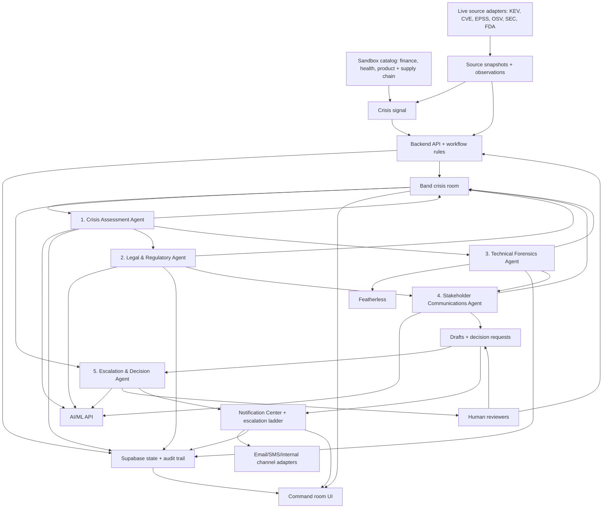

# Master Implementation Guide

Last updated: June 13, 2026.

## Purpose

This is the master guide for turning CrisisCoord from planning into implementation.

It answers the missing operating questions:

- what still needs to be built
- what the five agents actually do
- how the agents communicate through Band
- what the backend owns versus what Band owns
- where notifications and outbound communications go
- how global sector sandboxes should work
- what contributors should implement step by step

This document is not a legal guide. It is a product, architecture, and implementation guide for a global crisis-coordination platform.

## What Is Still Missing

The repo now has product vision, UI plans, stack standards, partner research, API notes, and phase planning. The remaining work is implementation.

The major unfinished pieces are:

1. App scaffold: React, TypeScript, Vite, Tailwind, routing, layout, and shared UI components.
2. Supabase schema: incidents, rooms, agent runs, findings, drafts, decisions, audit events, sandbox scenarios, and evidence references.
3. Band runtime path: confirm whether the first implementation uses Band SDK workers, Agent API workers, or a thin hybrid.
4. Agent contracts: Zod schemas for every agent input and output.
5. Band adapter: room creation, participant lookup, agent messages, structured events, context reads, and retry handling.
6. Model-provider adapter: AI/ML API, Featherless, fallback behavior, JSON validation, provider metadata, and timeouts.
7. Live-data adapters: CISA KEV, NVD, EPSS, OSV, GitHub Advisories, SEC EDGAR, openFDA, and optional OTX/AbuseIPDB/URLhaus.
8. Five-agent loop: one complete agent end to end, then the remaining four agents.
9. Server-side gates: especially Communications waiting on Legal and Technical.
10. Global sandbox catalog: finance, health, and product/supply-chain demo contexts.
11. Notification model: in-app Notification Center, acknowledgement state, escalation ladder, simulated outbound communication, provider status, and delivery attempts.
12. UI data wiring: global command bar, operational status strip, source feed, command room, agent rail, handoff topology, timeline, dependency gate, draft review, notification center, decision desk, provider health, and audit view.
13. Demo modes: live, assisted, and seeded fallback.
14. Figma repair: seven workspace triptychs with desktop, tablet, and mobile frames.
15. Verification: contract tests, agent tests, Playwright demo path, responsive checks, and doc consistency checks.

## Relationship To Phases

This guide supports the three delivery phases defined in [phased-delivery-plan.md](./phased-delivery-plan.md):

- Phase 1: Demo Sandbox Foundation. Build the synthetic five-agent hackathon demo.
- Phase 2: Integration Sandbox. Validate safe read-only signals, redaction, roles, RLS, and tabletop exercises.
- Phase 3: Controlled Enterprise Pilot. Connect one approved read-only enterprise source and keep outbound actions human-approved.

The master system flow, agent model, and sandbox portfolio should remain consistent across all three phases.

## Master System Flow

Use this Mermaid diagram as the source structure for the project. If the agent order, phase names, sandbox names, or provider assignments change, update this diagram and run the consistency skill.



Diagram rule:

- Mermaid is preferred over a static image because it lives with the document and updates in GitHub.
- If the team later exports an image for Gamma or Figma, export it from this Mermaid block.
- The exported image must not become the source of truth.

## The Five Agents

Keep the MVP at five agents. Five gives enough specialization for a regulated crisis without turning the demo into a large multi-agent mesh.

| Agent | Main job | Must read | Must produce | Default provider |
| --- | --- | --- | --- | --- |
| Crisis Assessment Agent | Classify signal type, severity, affected business area, known facts, assumptions, unknowns, and required specialist agents. | Sanitized crisis signal, sandbox profile, source metadata. | Assessment finding, severity, recommended agents, first Band room post. | AI/ML API |
| Legal & Regulatory Agent | Surface possible obligation paths, review clocks, caveats, jurisdiction unknowns, and approval requirements. | Assessment finding, affected data categories, jurisdictions, sector sandbox. | Obligation candidates, deadline candidates, legal unknowns, reviewer notes. | AI/ML API |
| Technical Forensics Agent | Summarize affected systems, likely scope, containment state, evidence confidence, and technical gaps. | Assessment finding, sanitized technical facts, evidence references. | Technical finding, containment status, affected systems, confidence, unknowns. | Featherless |
| Stakeholder Communications Agent | Draft review-only regulator, customer, executive, internal, and holding-statement language. | Validated Legal and Technical outputs for the same incident and room. | Draft communications in review state, audience, required approver, source links. | AI/ML API |
| Escalation & Decision Agent | Read full room state, detect conflicts, identify missing approvals, and ask humans for decisions. | Assessment, Legal, Technical, Communications drafts, audit timeline. | Decision requests, conflict flags, unresolved facts, recommended reviewer role. | AI/ML API |

Every agent node in the UI must show useful operating state, not just the agent name. At minimum, it should expose the input it read, output it posted, confidence, missing facts, Band reference, provider/model when AI-backed, and the next dependency. A reviewer should be able to click the node and understand why the system moved forward, blocked, or escalated.

## How Agents Communicate

Agents communicate through Band. They do not silently pass hidden state through a private chain.

The backend is the workflow rule layer. Band is the collaboration room. Supabase is the queryable app state and audit record.

### Communication Channels

Use three channels together:

1. Band messages: human-readable handoffs, mentions, findings, blocked notices, and decision requests.
2. Band events: structured status changes such as run started, dependency blocked, run completed, validation failed, and retry scheduled.
3. Supabase records: validated incident state, agent outputs, communication drafts, decision requests, and audit events.

Do not treat model-provider output as trusted communication. Model output must be parsed, validated, stored, and then posted or summarized.

### Standard Agent Run

Every agent run should follow this sequence:

1. Backend creates or resumes an `agent_runs` record with an idempotency key.
2. Backend posts a Band event: `agent.run.started`.
3. Agent reads the Band room context and the required Supabase state.
4. Agent validates that required dependencies are present.
5. Agent calls the assigned model provider or deterministic rule.
6. Backend validates the structured output with Zod.
7. Backend stores the validated output in Supabase.
8. Backend posts a Band message with the result summary and source references.
9. Backend posts a Band event: `agent.run.completed`, `agent.dependency.blocked`, or `agent.run.failed`.
10. UI updates from Supabase state and Band references.

### Message Types

Use consistent message types so the UI can render them predictably:

| Message type | Posted by | Purpose |
| --- | --- | --- |
| `assessment.summary` | Assessment | First crisis classification and required specialist agents. |
| `legal.obligations` | Legal | Possible obligations, clocks, caveats, and missing facts. |
| `technical.scope` | Technical | Affected systems, containment, confidence, and evidence gaps. |
| `communications.draft_ready` | Communications | Review-only draft package is ready. |
| `communications.blocked` | Backend or Communications | Legal and/or Technical dependencies are missing. |
| `escalation.decision_request` | Escalation | Human decision needed. |
| `human.decision` | Human reviewer through UI | Approval, rejection, request changes, or defer. |

### Event Types

Use events for machine-readable workflow state:

| Event type | When |
| --- | --- |
| `incident.signal.received` | A crisis signal enters the system. |
| `room.created` | Band room is created or linked. |
| `agent.run.started` | An agent begins work. |
| `agent.output.validated` | Zod validation passes. |
| `agent.dependency.blocked` | Required upstream output is missing or invalid. |
| `agent.run.completed` | Agent output is stored and posted. |
| `agent.run.failed` | Agent failed after retry policy. |
| `decision.requested` | Human decision is required. |
| `decision.recorded` | Human reviewer acts. |
| `notification.created` | A human owner, internal channel, or draft recipient package is queued. |
| `notification.acknowledged` | An assigned owner confirms they are active. |
| `notification.escalated` | The acknowledgement window expired or a reviewer manually escalated. |
| `communication.queued` | An approved draft is queued for simulated or configured delivery. |
| `communication.sent` | A test-safe provider send completed and provider metadata was stored. |
| `communication.failed` | A configured provider failed and the draft remains safe. |

### Dependency Rules

Communications is the key dependency gate:

```text
Assessment must exist.
Legal output must exist and validate.
Technical output must exist and validate.
Legal and Technical outputs must belong to the same incident_id and room_id.
Only then can Communications draft external-facing text.
```

Escalation can run in two modes:

- early mode: after Assessment, Legal, or Technical if a high-risk decision is already needed
- full-room mode: after Communications drafts exist

The demo should show full-room mode because it makes the Band handoff clearer.

## Backend Versus Band Ownership

| Concern | Owner |
| --- | --- |
| Room creation, participants, mentions, handoff messages, live collaboration | Band |
| Input validation, dependency gates, permissions, rate limits, retries | Backend |
| Incident records, agent outputs, drafts, decisions, notifications, delivery attempts, audit queries | Supabase |
| Structured reasoning, classification, summarization, drafting | Model providers through `model-provider` |
| Internal owner notification, acknowledgement timers, simulated send packages, provider metadata | Backend notification adapters |
| Final approval, external action, legal judgment, destructive action | Human reviewers |

The backend can orchestrate when agents run, but it should not become a hidden sixth agent. It is the rule layer.

## Global Sandbox Portfolio

CrisisCoord should work globally by using configurable sector profiles, not hard-coded country assumptions.

Each sandbox should define:

- sector
- fake organization profile
- operating regions
- data categories
- critical systems
- possible obligation families
- approved source anchors
- crisis signal examples
- safe evidence fields
- blocked evidence fields
- required human roles
- demo narrative

### Finance Sandbox

Use this for banks, payment processors, fintech, insurers, trading platforms, and public-company cyber scenarios.

Example signals:

- unauthorized access detected in payment system
- transaction monitoring platform unavailable
- suspicious admin token used against customer-account service
- vendor reports compromise affecting financial data
- cyber incident may be material to investors

Safe facts:

- affected system names
- record counts or ranges
- payment-card data category
- customer/account category
- region or jurisdiction candidates
- containment status
- service impact

Never send to model providers:

- full card numbers
- bank account numbers
- customer lists
- credentials
- transaction-level raw records
- unredacted KYC files

Useful global anchors:

- Financial Stability Board cyber resilience and incident-reporting convergence work
- Format for Incident Reporting Exchange for common operational incident fields
- GDPR breach notification guidance where EU personal data may be involved
- SEC cybersecurity disclosure review where public-company materiality is possible

### Health Sandbox

Use this for hospitals, clinics, health platforms, pharmacies, insurers, health-data processors, and patient-support tools.

Example signals:

- electronic health record export accessed by unauthorized user
- healthcare vendor reports breach of patient portal logs
- ransomware disrupts appointment or care coordination system
- medical-device telemetry service exposes patient-linked records
- patient support inbox receives breach complaint

Safe facts:

- affected health system or vendor
- patient-record category
- approximate affected count
- discovery time
- care-continuity impact
- encrypted versus unsecured data status
- vendor or business-associate role candidate

Never send to model providers:

- patient names
- diagnosis details
- full medical records
- insurance IDs
- appointment notes
- direct identifiers
- unredacted clinical messages

Useful global anchors:

- WHO digital health governance direction
- ISO 27799 health information security guidance
- OECD health data governance work
- HIPAA breach notification as a US-sector example
- GDPR breach notification where EU personal data may be involved

### Product And Supply Chain Sandbox

Use this for manufacturers, consumer-product companies, marketplaces, food or cosmetics workflows, logistics platforms, and software supply-chain incidents.

This is the third sandbox because it adds physical-safety and recall coordination. It also proves CrisisCoord is not only a cyber or data-breach product.

Example signals:

- product defect report suggests injury risk
- contaminated batch or unsafe component identified
- supplier breach affects customer orders or product traceability
- malicious dependency enters a production build
- marketplace receives repeated safety complaints about one product line

Safe facts:

- product category
- affected batch or version
- distribution regions
- supplier or vendor name category
- known hazard summary
- incident count or complaint count
- containment and recall-readiness status

Never send to model providers:

- individual customer identities
- private medical injury details
- confidential supplier contracts
- full litigation material
- trade secrets
- raw support inbox exports

Useful global anchors:

- OECD product safety recommendation and product-safety work
- UN consumer product safety principles
- CPSC recall notice guidance as a US example
- FDA recalls for regulated product categories where relevant
- national product-safety authority guidance based on the organization's operating regions

## Implementation Roadmap

### Step 1: Lock Contracts Before Coding Agents

Create shared Zod contracts for:

- `CrisisSignal`
- `SandboxProfile`
- `AgentRun`
- `AgentFinding`
- `LegalObligationCandidate`
- `TechnicalFinding`
- `CommunicationDraft`
- `DecisionRequest`
- `NotificationRequest`
- `NotificationAttempt`
- `AuditEvent`

Every UI, backend, and agent contributor should use these contracts.

### Step 2: Build One Scenario Loader

Create one loader for sandbox scenarios.

The loader should accept a sandbox ID such as:

```text
finance-payment-exposure
health-patient-record-exposure
product-supply-chain-recall
```

It should return:

- synthetic organization context
- crisis signal
- safe facts
- blocked facts
- expected agent route
- seeded fallback outputs

### Step 3: Implement The Backend Rule Layer

Build the API and service layer before complex agent behavior.

Required backend services:

- `incident-service`
- `sandbox-service`
- `band-service`
- `agent-run-service`
- `model-provider`
- `audit-service`
- `decision-service`
- `notification-service`
- `communication-delivery-service`
- `redaction-service`
- `rate-limit-service`

### Step 4: Wire Band Room Creation

Minimum Band proof:

- create or link a Band room
- add or identify five agent participants
- post the initial crisis signal summary
- post agent run events
- post at least three agent findings
- show Band references in the UI audit trail

### Step 5: Build One Agent End To End

Start with Crisis Assessment.

It touches every important pattern:

- reads crisis signal
- calls AI/ML API
- validates structured output
- writes Supabase records
- posts Band message
- emits audit events
- updates UI state

Do not build all five agent prompts before this loop works.

### Step 6: Add Technical And Legal

Build Technical and Legal next because Communications depends on them.

Recommended provider assignment:

- Technical uses Featherless.
- Legal uses AI/ML API.

Both must produce structured, validated findings with known facts, assumptions, unknowns, confidence, source references, and reviewer notes.

### Step 7: Add Communications Gate

Build the server-side gate before the Communications prompt.

If Legal or Technical is missing:

- store blocked `agent_runs`
- post `agent.dependency.blocked`
- show the blocked reason in UI
- do not call the model provider

If both exist:

- create review-only drafts
- attach Legal and Technical source IDs
- require human approval before any external action

### Step 8: Add Escalation And Decisions

Escalation should read the room, not just the latest message.

It should detect:

- conflicting facts
- missing containment status
- missing jurisdiction facts
- unclear affected count
- external communication risk
- unresolved legal or executive approval
- provider failure or low-confidence output

It should create decision requests, not final decisions.

### Step 9: Add Notification And Acknowledgement Flow

Notifications should prove that the app can move work to the right human without pretending to automate judgment.

Build:

- in-app notification records
- Band notification messages
- assigned owner and backup owner fields
- acknowledgement deadlines
- escalation ladder state
- notification attempts table
- simulated outbound communication queue
- provider status panel for email, SMS, and internal channels

For the hackathon demo, external stakeholder sends should remain simulated or test-recipient-only. The UI can show the payload, recipient label, provider, status, and audit event without contacting real customers, regulators, vendors, or the public.

### Step 10: Build The Command Room Around Real State

The UI should render:

- active sandbox
- crisis signal
- agent statuses
- Band timeline
- dependency gate
- Legal and Technical findings
- Communications drafts
- Escalation decisions
- Notification Center state
- acknowledgement and escalation ladder state
- simulated communication delivery log
- audit trail
- provider badges
- seeded/live demo state

### Step 11: Add Verification And Demo Readiness

Required checks:

- contract tests for all agent outputs
- server-side gate tests
- seeded scenario tests for all three sandboxes
- provider metadata test
- Band reference persistence test
- Playwright demo path for desktop, tablet, and mobile
- `node scripts/check-master-doc-consistency.mjs`

## Contributor Role Map

Use these roles to split work without overlapping:

| Role | Owns |
| --- | --- |
| Product/Docs Lead | Master guide, phase plan, scenario copy, demo script, submission wording. |
| UI Lead | Figma, command room layout, agent rail, dependency gate, responsive states. |
| Backend Lead | API routes, service layer, Supabase repositories, rate limits, audit events. |
| Band Integration Lead | Band room creation, participants, messages, events, WebSocket or SDK worker path. |
| Agent Contracts Lead | Zod schemas, fixtures, prompt inputs, validation, provider output parsing. |
| Model Provider Lead | AI/ML API, Featherless, fallback, provider metadata, timeouts. |
| Sandbox Lead | Finance, Health, Product/Supply Chain fake-company scenarios and safe facts. |
| Notification Lead | in-app notifications, acknowledgement, escalation ladder, simulated send packages, and provider health. |
| QA/Demo Lead | seeded fallback, Playwright, responsive checks, demo-day failure plan. |

## Non-Negotiable Rules

- Build globally. Do not hard-code one country or one regulator as the product default.
- Use synthetic data in demos and tests.
- Do not send raw sensitive data to model providers.
- Keep Communications blocked until Legal and Technical validate.
- Keep all generated external communications in draft state.
- Keep internal notifications, acknowledgement, and escalation visible in the UI.
- Keep outbound communications simulated or test-recipient-only during the hackathon unless explicitly configured.
- Keep Band visible as the agent collaboration layer.
- Keep Supabase as the queryable audit state.
- Keep provider metadata visible for model-backed runs.
- Keep the backend as the rule layer, not a hidden sixth agent.
- Update the Mermaid diagram when agent order, phase names, sandbox names, or provider assignments change.
- Run the doc consistency skill before merging major product, architecture, or agent workflow updates.

## Source Anchors For Global Work

- [Financial Stability Board cyber resilience](https://www.fsb.org/work-of-the-fsb/financial-innovation-and-structural-change/cyber-resilience/)
- [Format for Incident Reporting Exchange final report](https://www.fsb.org/2025/04/format-for-incident-reporting-exchange-fire-final-report/)
- [WHO digital health](https://www.who.int/health-topics/digital-health)
- [ISO 27799 health information security](https://www.iso.org/standard/62777.html)
- [OECD product safety](https://www.oecd.org/en/topics/sub-issues/product-safety.html)
- [OECD consumer product safety recommendation](https://legalinstruments.oecd.org/en/instruments/OECD-LEGAL-0459)
- [OECD privacy principles](https://www.oecd.org/en/topics/privacy-principles.html)
- [ISO/IEC 27035-1 information security incident management](https://www.iso.org/standard/78973.html)
